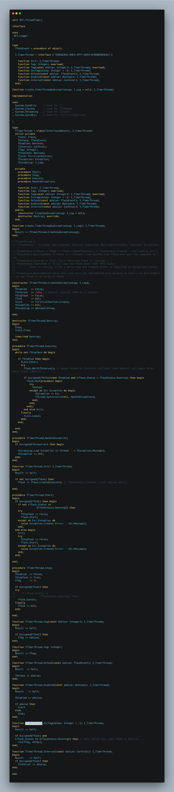

# MBen_TimerThread
Delphi Threaded Timer (currentlly target only vcl ..) but it's not that hard to make it adapted with FMX !!

# TimerThread Facebook Discussion here: 
https://www.facebook.com/share/p/4uhwFomSLoFt2bvX/

# TCaseTag Facebook Discussion here: 
https://www.facebook.com/share/p/tdUnwsvsm2G9knmv/
https://www.facebook.com/share/p/cin9meU99YmGvnRT/

#Using:

#API.ThreadTimer

